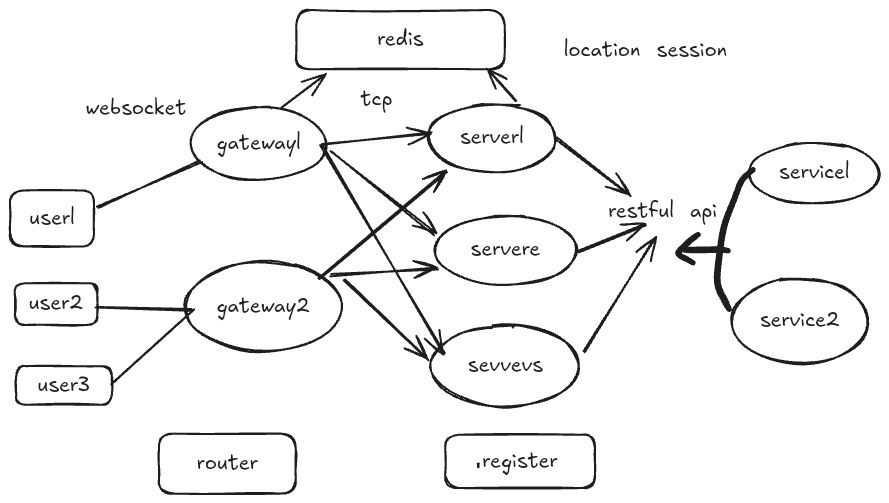

# cirno-im
【施工中】  
Golang高性能分布式IM

对于一个高性能的分布式IM需要考虑的点：
性能，存储，网络，安全，扩展，计算
# 通信层
对于该分布式IM，整体上来讲，系统被划分为三个层级：

1. SDK层 
2. 网关层
3. 逻辑服务层

为了保证通信效率的最大化，SDK层和网关层，网关层与逻辑服务层使用的协议可能不同。例如对于网关层可以使用ws tcp协议，但是网关和逻辑服务之间使用裸的tcp。对于不同协议之间的协调，存在着一定的复杂性。

1. 需要编写ws协议的通信逻辑用于网关层和web sdk的通信
2. 需要编写tcp协议的通信逻辑用于网关层与app sdk的通信
3. 需要编写tcp协议的通信逻辑用于网关层和逻辑服务层的通信

以上三种通信逻辑存在不小差异，例如对于ws协议，数据包的基本单位为Frame帧，但是TCP是数据流。对于拆包逻辑来讲，tcp和ws的差异也十分巨大，tcp是流式传输，所以一般是上层业务处理拆包，ws是基于frame，所以可以直接区分出每一个frame，在底层的server进行处理然后再传给上层业务。

我们需要对协议进行抽象，屏蔽掉tcp与ws之间的差异，这其实也就是通信层需要做的事情。

# 序列化
另外对于序列化方面，进行网络通信必然需要奖对象的状态信息转换为可用的形式，我们常用的序列化框架有：
* Fastjson/Jackson
* Thrift
* Protobuf
* Hessian

序列化的本质，就是一种特定的编码方式，例如我现在可以规定一种序列化方式，对于某个结构体pkt而言，有三个字段分别是：Source（uint32），Sequence（uint64），Data（[]byte）。
那么为了奖这个结构体序列化为可以在网络传输的形式，我们可以这么做，选择一种端序方式，前4个byte为Source字段的值，后8个byte为Sequence字段的值，最后还有一个4byte的数，要用于标识Data的大小。
## 常见的序列化方案对比
* **protobuf**：序列化后空间占用极小，因为其将某些字段更改为了可变长的形式。  
* **Json**：序列化后的长度很大，空间占用极大，优点是非常简单。

另外对于golang的[]byte()强转，其实也就是一次编码方式，默认使用utf-8编码。  
对于常见的序列化协议，基本上因为考虑通用性，在性能或者空间上都会有所折扣，对于通信系统来说这是不可忍受的，
所以一般而言，我们需要自己实现序列化协议。对于消息包的大小需要尽量减少，即使是对于一个字节，在千万级别并发下也是几千万个字节！

# 通信协议
在通信系统中，也需要设计一套协议，应用于用户与服务及服务之间的沟通。而一个协议通常由两部分组成：协议头、协议体。其中协议头中会有一个指令字段，类似于HTTP协议中的Path地址。在通信系统中，协议头按格式分为两种：定长和非定长。比如在定长的协议头中通常使用4字节的数字表示指令，定长协议头的优势就是解析方便且效率高，而非定长的协议头包容性更大更灵活。
  
通信层主要处理的对象就是Header，Body的内容是在指令处理器中被解析并且处理。

## 基础协议
web端api不开放websocket协议中的心跳协议，所以我们需要在业务层进行支持。  
对于心跳协议，应该在网关层就直接返回响应，不需要做实际的业务处理，并且由于心跳包发送相对来讲十分频繁，所以消息包也需要设计的尽量的小。  
## 协议区分
如前面所说，我们存在多种定制协议，为了进行协议区分，我们还需要在协议内部添加一个魔数，用于标识该消协议包是属于哪一个协议的。  
魔数这个概念相当的频繁，例如对于linux操作系统而言，魔数可以用于区分不同的文件格式。
 
# 容器层
目前的架构：

容器层的作用：
* 托管Server
* 维护服务的依赖关系
* 处理消息上下行

# 服务注册
与传统微服务不同的是，因为网关和逻辑服务是建立长连接的，如果一台逻辑服务下线，这里网关是可以立刻发现的，因为网关需要和所有逻辑服务建立连接。
而DNS服务发现是不可行的，道理同上。  
对于逻辑节点而言，网关需要快速响应逻辑的节点的上线，因为假设某一逻辑接线上线后，clientA通过网关，发送消息映射到了逻辑节点A，而此时目标网关还没与逻辑节点建立连接，
这就会导致消息发送失败产生的消息丢失。延迟几乎是不可避免的，但是我们需要尽量将延时降至最低。

