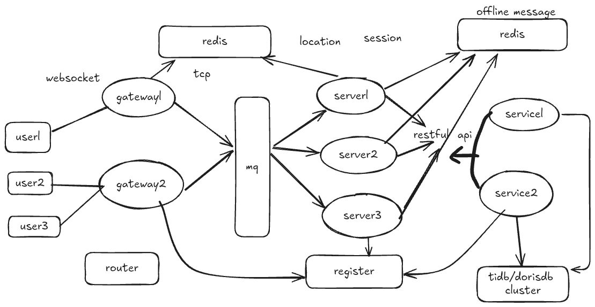

# cirno-im整体设计大纲

## 大致架构


网关：sdk侧实际与网关建立长连接，进行消息监听。并且可以将鉴权限流等逻辑分离到网关内。

逻辑服务：实际的业务处理，包含登录服务，聊天服务等。因为需要位置网关与逻辑服务起的会话，所以是有状态服务，可以通过一个redis将状态解耦，单独保存会话信息。

这是整体的架构，对于后端项目本身更加细分来讲，还存在以下层：

* 通信层： 正如上述所说，sdk与gateway实际建立的连接为ws连接，但是gatewway与logic server通信使用的是裸的tcp协议，用以加快通信效率。所以需要建立一个通信层，用以屏蔽websocket和裸的tcp协议之间的差异。

* 容器层：主要用于托管Server、维护服务的依赖关系、处理消息上下行。简单来讲其实就相当于一个中间层，用于解耦业务层和通信层。

* 链路层：

    - **节点连通链路**：在中间层之容器中，调用`cim.Dialer`接口中的`DialAndHandshake`方法实现**连接与握手**。同时在逻辑服务端`Accept`回调中就要处理网关发送的`握手包`。
    - **消息处理链路**：
        - 从SDK端出发，会有一个登录的过程。之后就是消息的发送，到达网关的Server端之后，通过消息监听器`Receive`回调给了业务层处理器`handler`，在`handler.Receive`方法中，传入的[]byte数据会被解包成**LogicPkt**对象，然后通过容器的调度转发到`Chat`服务中。
        - 在Chat中也是同样的逻辑，消息被Server回调给`handler.Receive`处理之后，就会调用指令路由器`Router`的`Serve`方法处理这条消息。在逻辑服务启动时，会把`指令处理器`注册到Router中，所以在Router.Serve方法内部可以根据消息头中的`Command`查找到对应的指令处理器。

## 架构优化



gateway与server层之间，会存在大量的消息，而且是长连接的，必然会导致大量的开销。最终甚至可能会导致server宕机，超高并发下，无法保证服务高可用。

可以选择在gateway和server层之间，加一个消息队列集群进行异步消息，当然发送的消息还是自定义的logic packet。

另外，这里的离线消息，原来是从关系型数据库内拉取的，效率不高，考虑到离线数据拉取的消息量有一定的限制，可以现将其存到redis集群内，作为一个缓存，可以加快离线同步的操作。

对于关系型数据库的选型，传统的mysql由于历史原因，实际上是趋于单机数据库的。如果我们想要在大数据量的场景下，需要选择真正意义上的分布式数据库，如tidb或者dorisdb

## 选型

### RPC


## 消息可靠投递

对于即时通讯系统而言，有两个重要指标：``可靠投递``和`及时投递`，可靠投递要求系统在-复杂的网络环境或者服务故障的情况下可以尽量保证消息不丢失，及时投递则是要求发送的消息可以尽快的送达到对方，如果对方处于离线状态，则需要通过推送服务将消息异步的投递过去。


**为了保证离线消息，发送方投递的消息在到达了chat服务之后，首先就是写入离线队列内，不管接收方是否在线**。为了保证额消息的投递成功，我们需要接收方主动告知服务端（返回一个ack消息），然后服务端将该条消息设置为已读，服务端是无法感知到客户端是否已经将消息持久化到本地存储了的。


但是这里存在一个问题，就是对于即时通讯系统而言，消息量是十分巨大的，如果说每一条消息都返回一个ack势必会对服务端造成巨大的影响。**由于消息是连续的，所以这里可以采用将多条消息合并为一个ack**，这样一个ack消息就可以保证多条消息已读了。


而对于客户端sdk侧而言，sdk发送消息之后需要等待服务端做出回应，如果说受到的resp不是success状态，sdk侧需要做出相应的处理，包含但不限于：

1. 消息重发
2. 断线重连
3. 错误上报


而对于离线逻辑而言，离线用户上线后需要从服务端拉取离线消息，以此进行消息同步。同步的方式一般有Pull和Push两种，字如其意，Pull是指客户端主动发起请求从服务端拉取消息，Push则是服务端主动向客户端发送请求。在本次的cirno-im中采用了Pull的方式处理离线逻辑。


而对于消息表的设计，比较常见的设计方案是直接添加一个delivered标志位用以标识是否已读，但是还是那个原因，我们的即时通讯系统存在百万级消息量，数据库的io操作是及其耗时的，如果这么设计，同步离线消息的时候将会设计大量的数据库更新操作，对性能造成影响。  
因此我们通过给每个用户在服务端添加一个`读索引`，而同时与SDK约定一条规则，`即在ACK时，只需要给一条发送时间最大的消息ID即可`。这样，就可以标识在这个id之前的所有id都已经被读取完毕了。使用读索引的另一个好处就是SDK登录之后，第一次请求离线消息时，可以把**本地数据库**中`最后一条消息的ID`作为`latest_ack_msg_id`的值，这样可以近一步解决本地SDK的读索引与服务端读索引不一致导致的消息重复同步。比如本地的最大读消息索引为`18`，因为SDK**最后一批消息**还没有ACK给服务端就离线了，此时服务端的读了索引为`10`，那么第一次同步消息时，就可以`减少8条消息`的同步。

另外，如果说一个用户在很长时间内没有上线。突然上线势必遗留大量的离线消息。如果这个时候进行同步就会导致一个问题，用户的程序会阻塞在这个同步过程，造成使用体验下降，这里的采用的方法是将消息索引和消息内容分离，同步的时候只用同步索引就好了，实际想查看会话的时候跟你局索引动态的加载消息内容即可。

### 消息存储与离线同步

#### 同步or异步？

对于消息是同步存储还是异步存储？

* 同步存储：消息写入数据库，事务提交完成后返回。
    * 优点：实现简单，消息几乎不会丢失
    * 缺点：需要等待消息落盘，实际存储在数据库内，写性能瓶颈，直接影响消息吞吐量。
* 异步存储：消息写入高速缓存或者其他的消息中间件内，然后有其他的线程将消息中间件内的消息同步到数据库内
    * 优点：性能高，发送方只需要往中间件内发送消息就行了，不需要同步阻塞。
    * 缺点：难以保证额消息可靠性，有概率导致消息丢失。

最终考量上，决定使用同步存储的方式。也就是直接使用mysql事务。

#### 存储设计

扩散写：对于每一个用户而言都会维护一个离线队列，扩散写就是用户在群组内发送消息，最终的结果就是给每一个用户的离线队列都会写一条消息。

读扩散：消息不会写多份，每个发送者和接受者之间会有一个独立的队列，最后读取消息的时候会从每一个队列内都读取离线消息。

cirno-im采用写扩散模型，主要是考虑到逻辑更简单容易实现，并且对于读扩散而言最终。

## 及时，可达，幂等，有序

### 及时

在网络连接正常的情况下，需要尽量使得整体服务性能较高，包含但不限于：

* 消息序列化反序列化速度
* 消息持久化速度
* 客户端拉取消息效率

### 可达

可达其实主要就是保证消息可靠性，即不丢消息。考虑到网络传输的不可靠性。最起码需要如下设计和实现：

* ack机制，消息被成功发送后，服务端主动推送ack到客户端，收到ack后，才代表消息真正到达了。
* 超时重传，如果在一定时间内未收到ack消息，则需要触发超时重传。
* 针对拉取通知的包也可能丢失，客户端需要做一个定时任务，定时向服务端拉取消息。
* 业务侧兜底保证，客户端拉消息通过一个本地的旧的序列号来拉取服务器的最新消息

###  幂等

因为超时重传，所以同一个消息会发送多次，这里主要是通过消息id保证的，对于每一个消息都有单独的一个消息id。

### 有序

im系统需要保证消息的顺序性，一般来讲都是通过时间进行排序。分为服务端和客户端的消息顺序性。

服务器层面：

* 单聊：通过发送方的绝对时序seq，来作为接收方的展现时序seq。实现方式：可以通过时间戳或者本地序列号方式来实现
* 群聊：因为发送方多点发送时序不一致，所以通过服务器的单点做序列化，也就是通过ID递增发号器服务来生成seq，接收方通过seq来进行展现时序。

客户端层面：

* 消息即使按照顺序到达服务器端，也会可能出现：不同消息到达接收端后，可能会出现“先产生的消息后到”“后产生的消息先到”等问题。所以客户端需要进行兜底的流量整形机制如何保证顺序？可以在接收方收到消息后进行判定，如果当前消息序号大于前一条消息的序号就将当前消息追加在会话里。否则继续往前查找倒数第二条、第三条等消息，一直查找到恰好小于当前推送消息的那条消息，然后插入在其后展示。

## 优化方案

### 批量ack

为了保证消息可达，需要ack确认机制，但是对于每条消息都确认，在im系统中是一个非常大的开销。

可以采用类似于tcp协议的delay ack机制，等待一段时间之后，发送一条ack消息，进行批量ack

所以，我们可以规定，在ACK时，只需要给一条发送时间最大的消息ID即可

### 通信协议

自定义logic packet和basic packet，分别用于用户服务间通信以及心跳。

### no-copy

对于websocket原先的逻辑来讲，我们是这么写的：

```go	
	
	mux := http.NewServeMux()
	......
	mux.HandleFunc("/", func(w http.ResponseWriter, r *http.Request) {
		// step 1
		rawconn, _, _, err := ws.UpgradeHTTP(r, w)
		if err != nil {
			resp(w, http.StatusBadRequest, err.Error())
			return
		}
		.........

	})
	return http.ListenAndServe(s.listen, mux)
```

可以看到，我们是通过直接创建了一个http mux进行协议升级的，但是对于golang原生的http包，生成request和response的核心方法，存在一次拷贝，对于分布式im这种大规模数据的场景下，应该尽量避免所有不该有的拷贝，以免造成多余的性能以及空间开销。

使用`gobwas/ws`这个websocket库，可以在tcp的基础中，直接解析http头，跳过了go默认的http包中的逻辑，这样就可以减少额外的空间开销。

最后的核心逻辑就变成这样了，直接在tcp层面对websocket进行升级。

```go	
for {
		rawconn, err := lst.Accept()
		if err != nil {
			rawconn.Close()
			log.Warn(err)
			continue
		}
         _, err = ws.Upgrade(rawconn)  <-- 升级
		if err != nil {
			rawconn.Close()
			log.Warn(err)
			continue
		}
		go func(rawconn net.Conn) {
			conn := NewConn(rawconn)
			...
		}(rawconn)
	}
```

另外，如果在tcp层面对websocket的进行升级，我们就会发现，其实对于tcp以及websocket协议进行消息传输时的逻辑，在现在看来就大差不差了。唯一的不同就是websocket多一步upgrade的操作，后续的连接操作就全部一样了。所以其实可以进一步抽象，将tcp和websocket的server的核心逻辑抽象成一个统一的default_server。

### 缓冲

我们的各种数据比如消息数据最终一定会落到磁盘上，所以会产生读写IO

在操作系统中，`用户态`与`内核态`是两个不同的世界，**用户态程序是无法把数据直接写入（或读取）内核态的内存空间**，比如如操作系统创建的TCP缓冲区；而是通过操作系统提供的`trap指令`完成。比如在向一个网络socket写数据时，当前**执行线程**由于执行**trap指令**会主动让出CPU（**陷入内核态**），由**操作系统**执行相关系统调用（`数据copy`），完成之后再通过调度逻辑把这个线程恢复执行（得到CPU）。这个过程**相对来说比较耗时**，因此，减少IO操作也就在一定程序上提高了程序性能。

缓冲是利用一块内存空间当作一个**蓄水池**，通过合并多次IO读、写操作，达到提高性能的目的。

最终落到实现上，可以对conn分别建立读缓冲以及写缓冲，然后后面的读写逻辑就针对这个缓冲区来讲就好。

### 存储

登录的性能主要与会话的写性能相关，而单聊和群聊的性能瓶颈取决于**寻址速度**与**消息存储耗时**，不过采用mysql与消息扩展写的方案，消息存储吞吐量优化空间有限，因此本章就不涉及消息写相关的优化。

对于寻址速度而言，我们将会话关系解耦出来，最终是存储在redis上的，所以redis的数据获取速度其实也就是寻址速度。

对于redis而言，虽然单机理论可以抗十万级别并发，但是我们的im系统是要求可抗百万并发的，所以我们需要使用redis集群，比较简单的方式是使用数据分片，将不同的key映射到不同的redis实例内。


## 智能路由

本质上就是特殊的clb，其主要是为了保证负载的最优化。

例如，对于不同的IP地址恶意将其负载到对应国家或者地区的服务器，然后通过负载率等选择负载较低的网关建立长连接。这样既可以保证网关的压力不那么大，而且可以加快通信效率。

## 多租户

`多租户`简单来说是指一个单独的实例可以为**多个组织服务**。多租户技术为共用的数据中心内如何以单一系统架构与服务提供多数客户端相同甚至可定制化的服务，并且仍然可以保障客户的数据隔离。一个支持多租户技术的系统需要在设计上对它的数据和配置进行虚拟分区，从而使系统的每个租户或称组织都能够使用一个单独的系统实例，并且每个租户都可以根据自己的需求对租用的系统实例进行个性化配置。

**按部署模式来说，多租户又有如下情况**：

1. **单独**或**共享**应用程序
2. **单独**或**共享**数据库

## 灰度

一般来讲，都是通过流量网关进行灰度的。
